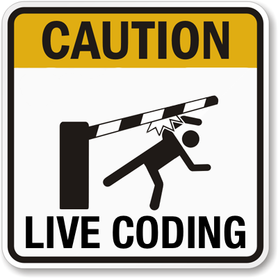

!SLIDE center
# Authoring and Publishing your own RubyGem #

February 16th, 2012 - github.com/TampaRuby

!SLIDE

# Jason L Perry
## @ambethia

!SLIDE bullets incremental

# Overview

* What's a `gem`?
* Authoring
* Publishing

!SLIDE

# Part I: What is a ruby gem?

!SLIDE bullets incremental

# Packaged ruby code

* Command line tools
* Libraries & frameworks
* Extending `↑`

!SLIDE bullets incremental

# Easy package management

* `gem install nyancat`

!SLIDE bullets incremental

# Gem Sources

* `gems.rubyforge.org`
* `gems.github.org`
* `gems.rubyforge.org → rubygems.org`

!SLIDE bullets incremental

# Multiple Platforms

* Default: `Gem::Platform::RUBY`
* Win32
* Java (`jruby`)

!SLIDE bullets incremental

# C Extensions 

* `Building native extensions.  This could take a while...`

!SLIDE

# So, what is a `gem` _really_?

!SLIDE center

!SLIDE center

!SLIDE smallest

# The Gemspec

    @@@ ruby
    Gem::Specification.new do |s|
      s.name        = 'werewolf'
      s.version     = '0.0.0'
      s.date        = '2012-02-16'
      s.summary     = "werewolf!"
      s.description = "Awoo!"
      s.authors     = ["Jason L Perry"]
      s.email       = 'jasper@ambethia.com'
      s.files       = ["lib/werewolf.rb"]
      s.homepage    = 'http://rubygems.org/gems/werewolf'
    end

!SLIDE smallest

# Hoe, Echoe

    @@@ ruby
    require './lib/hoe.rb'

    Hoe.new("hoe", Hoe::VERSION) do |p|
      p.rubyforge_name = "seattlerb"
      p.summary = "Hoe is a way to write Rakefiles much easier and cleaner."
      p.description = p.paragraphs_of('README.txt', 2..5).join("\n\n")
      p.url = p.paragraphs_of('README.txt', 0).first.split(/\n/)[1..-1]
      p.changes = p.paragraphs_of('History.txt', 0..1).join("\n\n")
    end

!SLIDE smallest

# Jeweler

    @@@ ruby
    require 'rake'

    begin
      require 'jeweler'
      Jeweler::Tasks.new do |gem|
        gem.name = "smtp-tls"
        gem.summary = "SMTP TLS (SSL) extension for Net::SMTP"
        gem.description = "A gem package for the SMTP TLS code that's been floating around for years"
        gem.email = "jasper@ambethia.com"
        gem.homepage = "http://github.com/ambethia/smtp-tls"
        gem.authors = ["Unknown", "Jason L Perry", "Elliot Cable"]
      end
    rescue LoadError
      puts "Jeweler not available. Install it with: sudo gem install technicalpickles-jeweler -s http://gems.github.com"
    end

!SLIDE smallest

# The Gemspec

    @@@ ruby
    Gem::Specification.new do |s|
      s.name        = 'werewolf'
      s.version     = '0.0.0'
      s.date        = '2012-02-16'
      s.summary     = "werewolf!"
      s.description = "Awoo!"
      s.authors     = ["Jason L Perry"]
      s.email       = 'jasper@ambethia.com'
      s.files       = ["lib/werewolf.rb"]
      s.homepage    = 'http://rubygems.org/gems/werewolf'
    end

!SLIDE

# Part II: Authoring

!SLIDE

# Basic Structure

              % tree
              .
              ├── bin
              │   └── werewolf
              ├── lib
              │   └── werewolf.rb
              └── werewolf.gemspec

!SLIDE

    % gem build werewolf.gemspec
    Successfully built RubyGem
    Name: werewolf
    Version: 0.0.0
    File: werewolf-0.0.0.gem

    % gem install ./werewolf-0.0.0.gem
    Successfully installed werewolf-0.0.0
    1 gem installed

!SLIDE smallest

    @@@ ruby
    #!/usr/bin/env ruby
    #
    # This file was generated by RubyGems.
    #
    # The application 'werewolf' is installed as part of a gem, and
    # this file is here to facilitate running it.
    #

    require 'rubygems'

    version = ">= 0"

    if ARGV.first =~ /^_(.*)_$/ and Gem::Version.correct? $1 then
      version = $1
      ARGV.shift
    end

    gem 'werewolf', version
    load Gem.bin_path('werewolf', 'werewolf', version)

!SLIDE

# Part III: Publishing

!SLIDE

First we need a gem...

!SLIDE smaller

    ∴ rails plugin new time_tag
          create  
          create  README.rdoc
          create  Rakefile
          create  time_tag.gemspec
          create  MIT-LICENSE
          create  .gitignore
          create  Gemfile
          create  lib/time_tag.rb
          create  lib/tasks/time_tag_tasks.rake
          create  lib/time_tag/version.rb
          create  test/test_helper.rb
          create  test/time_tag_test.rb
          append  Rakefile
      vendor_app  test/dummy
             run  bundle install
    ...
    Using time_tag (0.0.1) from source at /Users/ambethia/Desktop/time_tag 
    Your bundle is complete! It was installed into ./.bundle

!SLIDE smaller

        ∴ tree
        .
        ├── Gemfile
        ├── Gemfile.lock
        ├── MIT-LICENSE
        ├── README.rdoc
        ├── Rakefile
        ├── lib
        │   ├── tasks
        │   │   └── time_tag_tasks.rake
        │   ├── time_tag
        │   │   └── version.rb
        │   └── time_tag.rb
        ├── test
        │   ├── dummy
        │   │   └── [AN ENTIRE FREAKIN' RAILS APP]
        │   ├── test_helper.rb
        │   └── time_tag_test.rb
        └── time_tag.gemspec

!SLIDE

    @@@ ruby
    module TimeTag
      # YOUR CODE HERE.
    end

`lib/time_tag.rb`

!SLIDE

## How does rails know about my gem?

!SLIDE

            Rails::Railtie
            └── Rails::Engine
                ├── Rails::Application
                └── Rails::Plugin

!SLIDE

# `Rails::Plugin`

This is how your old plugins in `vendor/plugins` are being loaded and why they still work. You never inherit from this yourself.

!SLIDE

            Rails::Railtie
            └── Rails::Engine
                ├── Rails::Application
                └── Rails::Plugin

!SLIDE

# `Rails::Application`

This is what your app is.

    module ZomboCom
      class Application < Rails::Application
        # ...
      end
    end

`config/application.rb`

!SLIDE

            Rails::Railtie
            └── Rails::Engine
                ├── Rails::Application
                └── Rails::Plugin

!SLIDE

# `Rails::Engine`

This is where a lot of the rails magic is setup. Auto-loading, view template paths, routes, crap like that. This is probably what you'll be inheriting from most of the time.

    # ENGINE/config/routes.rb
    Werewolf::Engine.routes.draw do
      match "/" => "village#index"
    end

!SLIDE

# `Rails::Railtie`

The core class that each component of rails implements at some level.

!SLIDE smaller

    @@@ ruby
    module Werewolf
      class Railtie < Rails::Railtie
        # Here we can setup generators, initializers,
        # load rake tasks or any other things that need
        # to be done early in the rails boot process.
        #
        # http://api.rubyonrails.org/classes/Rails/Railtie.html
        # Really.
        #
        initializer "werewolf.config_initialization" do |app|
          app.middleware.use Werewolf::Middleware
        end
      end
    end

!SLIDE bullets incremental

In short:

* Everything, `Active::Record`, `Action::Mailer`, all of it, are Railties.
* In Rails 3, This is what makes your exention a "first class citizen" in rails.
* ORMs, ODMs, Middleware, template handlers, etc.

!SLIDE

# `time_tag`

!SLIDE

# `time_tag_in_words`

!SLIDE

    @@@ ruby
    time_tag_in_words(2.hours.ago)

`↓`

    @@@ html
    <time datetime="2012-02-16 08:54:13"
      title="February 16th, 2012 08:54">
        about 2 hours ago
    </time>

!SLIDE center

!SLIDE bullets incremental

# What else can we do?

* i18n
* style the tooltip (with the asset pipeline)
* formatting options
* refactor to use Rails' `time_tag`

!SLIDE

# Fin
